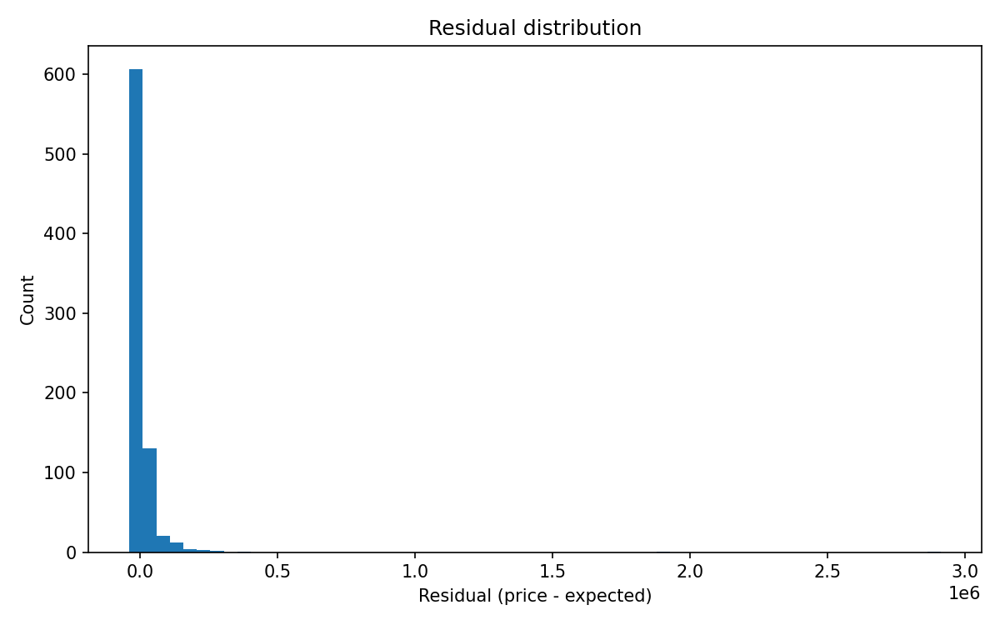
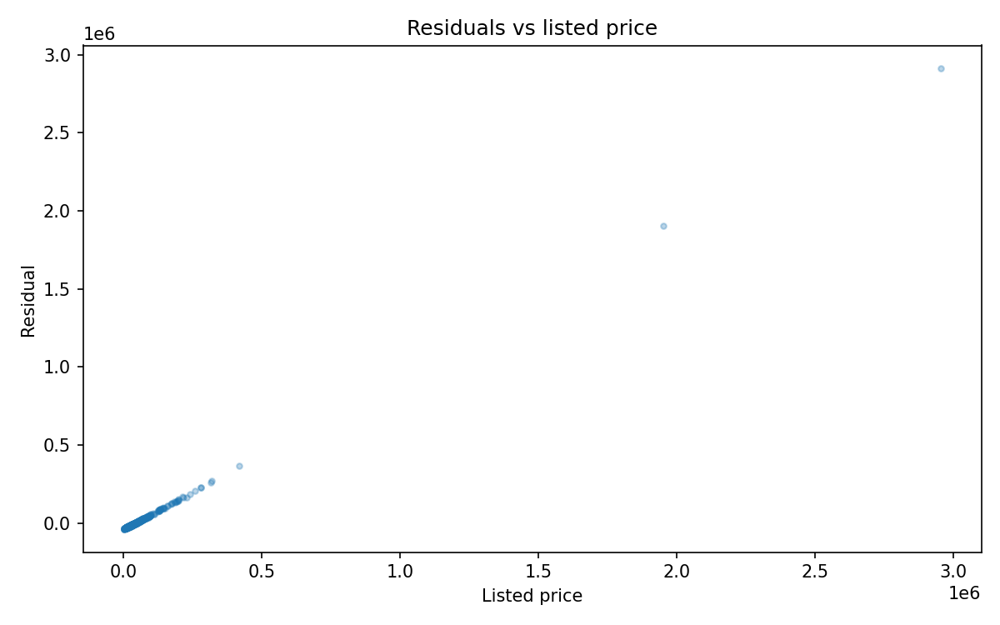
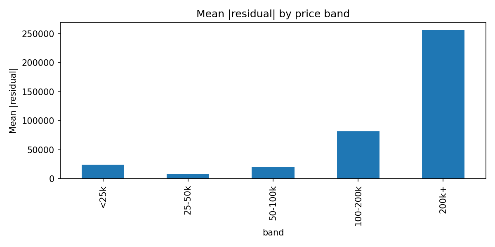
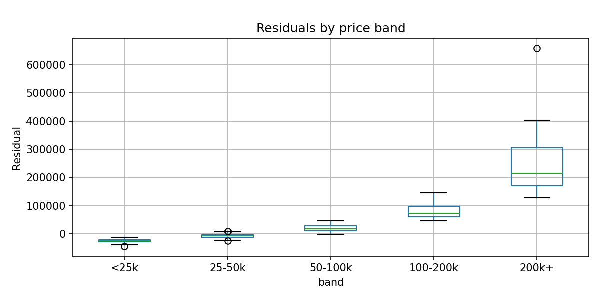

# Used Car Price Deviation Detector

A system that estimates a used car's expected market price and quantifies deviations between the expected and listed price.

## Overview

In this project I built a used-car price deviation detector, not a price predictor. The model estimates an expected market value using a Random Forest regressor because RFs do local averaging, are stable on tabular data, and remain interpretable. The pipeline cleans raw CSV data into a stable schema (brand, model, year, mileage, accident, clean title, fuel type, derived engine displacement and transmission type), then one-hot encodes categoricals and trains a conservative RF to reduce variance. I evaluate with MAE/RMSE as sanity checks, but the main output is the residual: listed price minus expected price. Because high-end exotics create heavy tails, I calibrate deviation thresholds by price band: I compute the 80th percentile of |residual| per band and use that as the band's fairness cutoff. That yields a stable 'fair' rate across bands and makes under/over labels interpretable. I also ran a small sensitivity check on leaf size and random seeds to verify label stability; flip rates were low, so I chose a leaf size of 5. Final outputs include cleaned data, a trained pipeline artifact, labeled listings, and residual diagnostics.

I started by scanning the raw Kaggle fields and doing a quick manual pass. Some columns were clean (like model_year), while others had the same info but messy formatting (engine, transmission). I dropped interior and exterior color because they're mostly weak signals for price, and I organized the remaining columns into raw/core/aux/drop groups in `src/config.py`. With some research and AI guidance, I chose the features most likely to affect price. Then I derived two standardized features from messy text, engine displacement (liters) and transmission type, using regex rules so they're consistent. I also tracked how many rows had usable signals after cleaning in `src/preprocess.py`. Once the schema was stable, I wrote out a clean CSV for modeling.

You should remember the goal here is stable residuals, not perfect accuracy. I prioritized low variance and local consistency, so I chose a Random Forest instead of a neural net; RFs do local averaging on tabular data, which makes expected values more stable. I defined a clean feature contract in `src/config.py`, enforced it in preprocessing, and then trained on the cleaned CSV only. In training, I used a pipeline + ColumnTransformer so encoding and imputing are applied only after the train/validation split (to avoid leakage). Categorical features are one-hot encoded, numeric features are median-imputed, categorical features are "unknown"-imputed. I kept RF params conservative (e.g., min_samples_leaf=5, min_samples_split=20, sqrt features, 200 trees) to reduce variance. I evaluate with MAE/RMSE as sanity checks, and I focus on residual behavior rather than chasing the lowest error. I did notice the RMSE was a great deal more than the MAE, meaning that a few very large outliers did exist (because RMSE squares); this is the first time I noticed it in the data programmatically. I deal with this later, but this is the first time I notice it.

I label listings based on residuals: residual = listed_price - expected_price. Within each price band, I compute a threshold (the 80th percentile of |residual|, meaning abs value if you didn't know). If a residual is less than -threshold it's underpriced, greater than +threshold it's overpriced, and anything in between is fair. I used price bands because the high-end/exotic listings create extreme residuals that distort a single global threshold, so band-specific thresholds make "fair" mean "within the typical error for that band" and keep labels stable and interpretable.

For EDA, I plotted category frequencies (brand, model, fuel type, transmission, accident, clean title) and histograms for numeric fields (price, milage, model_year, engine liters). That showed me distribution skew, high-cardinality categories, and the long-tail price behavior; this directly motivated price bands and helped sanity-check the cleaned features.

I didn't do formal hyperparameter tuning because the project goal isn't max accuracy, rather it's stable, interpretable residuals. Heavy tuning would optimize global metrics at the cost of local stability and interpretability (the goal of this project). I did a small, reasoned sensitivity check (leaf size and seeds) to confirm that residuals and label stability didn't swing wildly with minor parameter changes. That's enough for this project's scope.

## Quickstart

1. Put the Kaggle CSV at `data/raw/used_cars.csv`.
2. Install dependencies:

```bash
pip install -r requirements.txt
```

3. Run the full pipeline:

```bash
python src/main.py
```

This writes the cleaned CSV, trains the model, saves the pipeline, and generates deviation labels plus diagnostics.

## Data

- Source: Kaggle used-car listings dataset (public).
- Raw input expected at `data/raw/used_cars.csv`.
- Required raw fields include: price, brand, model, model_year, milage, accident, clean_title, engine, transmission, fuel_type.
- Note: the dataset uses `milage` (misspelled), and the code preserves that column name to avoid schema drift.

## Project structure

- `src/preprocess.py`: raw-to-clean schema, feature derivation, row drops, sanity filters.
- `src/config.py`: feature contracts (core vs auxiliary vs dropped).
- `src/train_model.py`: preprocessing + Random Forest pipeline, metrics, and model training.
- `src/assess_deviation.py`: residuals, band thresholds, labeling, and outputs.
- `src/compare_leaf_sizes.py`: small stability check for leaf sizes and seeds.
- `data/raw`: raw Kaggle CSV (not checked in).
- `data/processed`: cleaned and labeled CSV outputs.
- `models`: saved pipeline artifact.
- `reports/figures`: EDA and residual diagnostics.
- `reports/tables`: labeled validation samples.

## Project flow (MLE pipeline, for transparency purposes)

1. **Define objective**: deviation detection with stable residuals (not max accuracy).
2. **Get data**: place Kaggle CSV at `data/raw/used_cars.csv`.
3. **EDA**: run `src/eda.py` to inspect distributions and category balance.
4. **Preprocess**: `src/preprocess.py` enforces schema and derives clean features.
5. **Train/validate**: `src/train_model.py` builds a pipeline and fits the RF.
6. **Evaluate**: MAE/RMSE + residual diagnostics on validation split.
7. **Label deviations**: `src/assess_deviation.py` computes banded thresholds and labels.
8. **Persist outputs**: cleaned data, labeled data, plots, and the saved pipeline.

Simple data flow:

```
data/raw/used_cars.csv
  -> src/preprocess.py
  -> data/processed/used_cars_clean.csv
  -> src/train_model.py
  -> models/rf_expected_price.joblib
  -> src/assess_deviation.py
  -> data/processed/used_cars_labeled.csv
     reports/figures/*.png
     reports/tables/validation_labeled.csv
```

## Outputs

- `data/processed/used_cars_clean.csv`: cleaned modeling dataset.
- `data/processed/used_cars_labeled.csv`: full dataset with residuals and deviation labels.
- `models/rf_expected_price.joblib`: trained pipeline artifact.
- `reports/figures/*.png`: EDA and residual diagnostics.
- `reports/tables/validation_labeled.csv`: labeled validation split for inspection.

## Validation diagnostics

These plots are generated on the validation split (via `src/assess_deviation.py`) and help track residual behavior and band stability.






## Limitations and tradeoffs

- High-end exotics are real listings but very rare, so the model regresses toward typical prices and produces huge residuals in that band.
- Model and brand are high-cardinality features; one-hot encoding is acceptable here but can inflate dimensionality.
- Thresholds are data-driven per band, which is intentional for stability but should be documented when used downstream.

## Notes

- This project prioritizes stable residuals and interpretability over max accuracy.
- The Random Forest is intentionally conservative to lower variance in expected price estimates.
